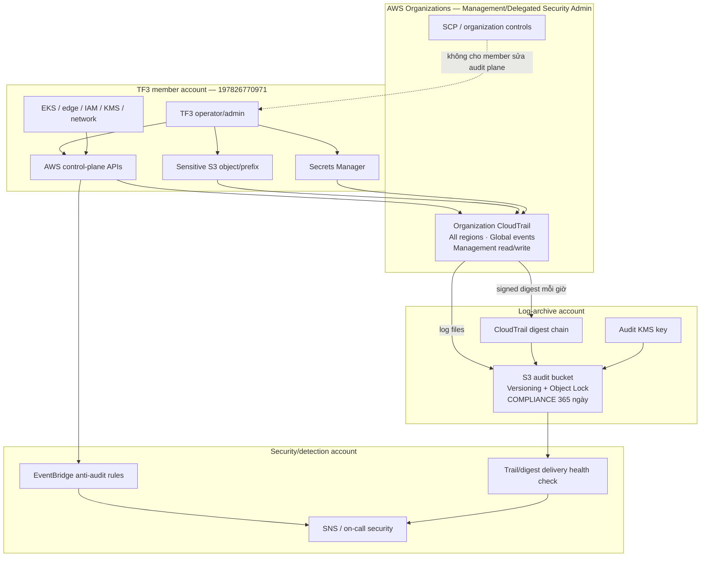
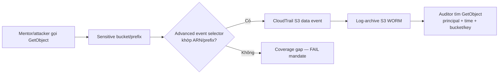
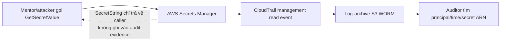
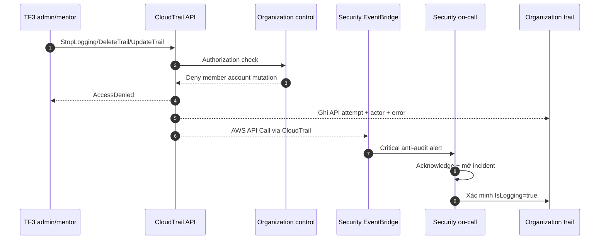
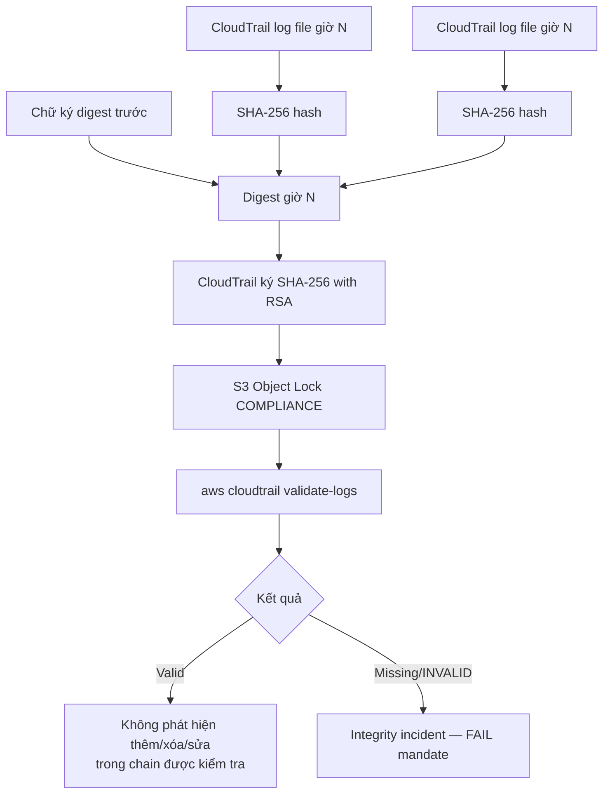
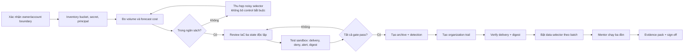
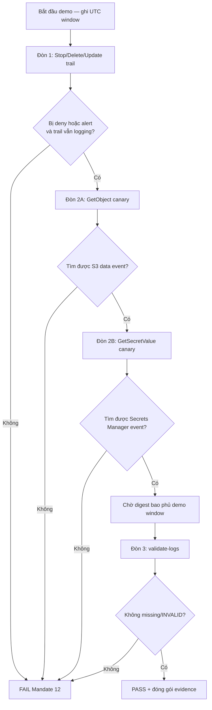
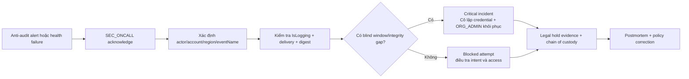

# Thiết kế flow Mandate 12 — Audit không thể bị đánh bại

## 1. Mục tiêu thiết kế

Thiết kế audit flow cho AWS account TF3 `197826770971` sao cho:

- TF3 operator, kể cả principal có quyền admin trong member account, không thể âm thầm dừng hoặc thay đổi đường ghi log;
- hành vi đọc S3 object nhạy cảm và đọc Secrets Manager đều truy được actor, thời gian và resource;
- log sau khi giao vào S3 được bảo vệ bằng Object Lock và kiểm chứng bằng chuỗi digest ký số;
- hành vi tấn công audit plane tạo cảnh báo tới security owner nằm ngoài blast radius của TF3;
- không thay đổi storefront public, cổng vận hành private hoặc flagd.

## 2. Ranh giới sở hữu



### Nguyên tắc ownership

| Thành phần | Owner | TF3 operator được làm gì |
|---|---|---|
| Organization trail | Management/delegated security admin | Xem status và dùng log theo quyền auditor; không sửa/dừng/xóa |
| SCP/organization controls | Management account | Không sửa |
| Audit bucket/Object Lock | Log-archive account | Không xóa, đổi retention hoặc bucket policy |
| Audit KMS key | Log-archive/security account | Không disable, schedule deletion hoặc sửa key policy |
| Detection và alert destination | Security account | Không tắt rule, target hoặc subscription |
| Resource inventory/test fixture | TF3 | Quản lý theo PR/change process |

## 3. Flow ghi log bình thường

```mermaid
sequenceDiagram
    autonumber
    participant Actor as User/Role/Service trong TF3
    participant API as AWS API
    participant CT as Organization CloudTrail
    participant KMS as Audit KMS key
    participant S3 as Log-archive S3 WORM
    participant Auditor as Auditor

    Actor->>API: Gọi API quản trị hoặc data operation được chọn
    API-->>Actor: Kết quả thành công/thất bại
    API-->>CT: CloudTrail event
    CT->>KMS: Mã hóa log delivery
    KMS-->>CT: Data key/cipher operation
    CT->>S3: Giao log file
    CT->>S3: Giao signed digest theo giờ
    S3-->>S3: Versioning + COMPLIANCE retention 365 ngày
    Auditor->>S3: Đọc log/digest bằng quyền read-only
    Auditor->>Auditor: Query actor, time, resource, action, outcome
```

### Nội dung tối thiểu cần truy được

- `eventTime` theo UTC;
- `recipientAccountId`, region và event source;
- `userIdentity`/principal/session issuer;
- `eventName`, resource ARN hoặc bucket/key phù hợp;
- source IP, user agent và request ID;
- success/error code;
- không ghi credential hoặc giá trị secret.

## 4. Flow đóng coverage gap

### 4.1 Đọc S3 object nhạy cảm

S3 object operation là **data event**, không được bảo đảm chỉ bằng management event.



Selector phải ưu tiên bucket/prefix đã phân loại nhạy cảm. Không bật wildcard mọi bucket trước khi có baseline volume và cost.

### 4.2 Đọc secret

`GetSecretValue` và `BatchGetSecretValue` tạo CloudTrail entry từ Secrets Manager. Đây là API event của Secrets Manager, không phải S3 data event.



Demo dùng secret canary vô giá trị. Không bật debug CLI và không lưu raw response chứa `SecretString`.

### 4.3 Thay đổi cấu hình quan trọng

Management read/write events phải cover ít nhất:

- CloudTrail và audit configuration;
- IAM/STS và access policy;
- KMS key/policy/grant;
- S3 bucket policy, lifecycle, encryption và Object Lock;
- Secrets Manager configuration/rotation/deletion;
- EKS, EC2/VPC, CloudFront/WAF và networking;
- AWS Organizations, delegated administrator, trusted access và SCP.

## 5. Flow chống làm mù



### Event cần cảnh báo

| Nhóm | Event điển hình | Mức |
|---|---|---|
| Trail | `StopLogging`, `DeleteTrail`, `UpdateTrail`, `PutEventSelectors` | Critical |
| Archive S3 | đổi bucket policy/Object Lock/lifecycle/encryption, delete attempt | Critical |
| KMS | disable key, schedule deletion, sửa key policy/grant | Critical |
| Organizations | disable trusted access, deregister delegated admin, leave/remove account, sửa SCP bảo vệ | Critical |
| Detection | disable/delete rule/target/topic/subscription | Critical |

EventBridge delivery là đường cảnh báo nhanh nhưng không phải bằng chứng duy nhất. Health check độc lập phải phát hiện `IsLogging=false`, delivery error, digest trễ hoặc alert heartbeat thất bại.

## 6. Flow toàn vẹn mật mã



Integrity validation chứng minh file đã được delivery không bị sửa/xóa và phát hiện chain gap. Nó **không chứng minh coverage đầy đủ** nếu selector chưa thu sự kiện; do đó coverage test và digest validation là hai gate riêng.

## 7. Flow triển khai



### Thứ tự bảo đảm không có blind window

1. Archive bucket, KMS và alert path sẵn sàng trước.
2. Organization trail bắt đầu ghi management events và validation.
3. Xác minh log/digest thực sự đến archive.
4. Bật data event selector theo batch.
5. Chỉ bỏ trail cũ sau khi trail mới đã có delivery/digest hợp lệ; overlap tối đa khoảng một ngày để hạn chế duplicate cost.

## 8. Flow mentor kiểm thử

Flow dưới đây là luồng tổng quát. Test ID, giới hạn production/sandbox, expected events và mẫu verdict chi tiết nằm trong `06-kich-ban-tan-cong-va-bang-chung-mandate-12.md`.



### Evidence pack

| Đòn | Evidence đầu vào | Evidence đầu ra |
|---|---|---|
| Làm mù | principal, command/API, UTC time | AccessDenied hoặc alarm, CloudTrail attempt event, `IsLogging=true` |
| Làm hụt — S3 | canary bucket/key, request ID | `GetObject` data event đúng actor/time/resource |
| Làm hụt — secret | canary secret ARN, request ID | `GetSecretValue` event; không chứa secret value |
| Làm mỏng/sửa | trail ARN, account, region, UTC range | `validate-logs` summary không có missing/`INVALID` |

## 9. Flow xử lý sự cố audit



Không xóa/recreate trail vội khi điều tra vì có thể làm đứt continuity. Không nới bucket/KMS policy thành quyền rộng để chữa delivery error.

## 10. Flow cost control

```text
S3 data-event count
        × CloudTrail data-event unit price
      + delivered log GB
        × delivery/storage price theo region và tier
      + KMS requests + alerting/query
      = audit stack cost
```

Kiểm soát chi phí theo thứ tự:

1. Loại noisy bucket/prefix không nhạy cảm khỏi data selector.
2. Dùng lifecycle tiering nhưng không rút ngắn Object Lock.
3. Tắt tính năng tùy chọn như Insights/Lake nếu chưa có use case.
4. Loại duplicate trail sau migration gate.
5. Không tắt management logging, integrity validation hoặc anti-audit alert để giảm chi phí.

## 11. Acceptance gates

| Gate | Điều kiện pass |
|---|---|
| Ownership | TF3 admin không quản trị organization trail/archive/KMS/detection |
| Blind-window | Stop/Delete/Update attempt bị deny hoặc báo động; trail tiếp tục ghi |
| S3 coverage | `GetObject` canary xuất hiện đúng dưới dạng data event |
| Secret coverage | `GetSecretValue` canary xuất hiện và không lộ secret value |
| Integrity | `validate-logs` pass, không missing/`INVALID` trong demo window |
| Retention | Versioning + Object Lock Compliance 365 ngày; không thể rút ngắn |
| Detection | Alert đến security owner, có actor/time/account/region |
| Cost | Forecast và actual không làm tổng TF vượt khoảng `$300/tuần` |
| Product safety | Không diff storefront, private ops path hoặc flagd |

Chỉ khi tất cả gate đều pass mới chuyển trạng thái từ `DEPLOYED` sang `VERIFIED`.
