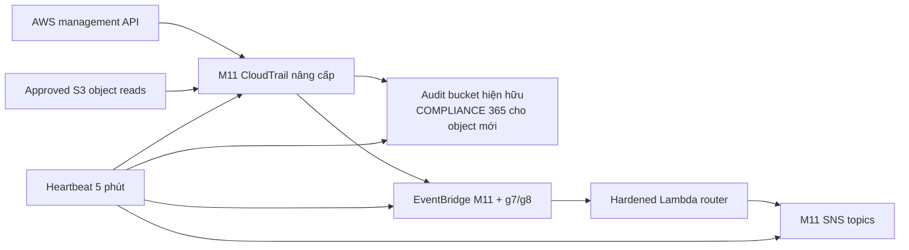

# Mandate 12 — Kế hoạch triển khai Audit Anti-Defeat

> **TF3 · AWS account `197826770971` · `ap-southeast-1`**  
> **Phiên bản:** v2.0 · **Cập nhật:** 21/07/2026  
> **Trạng thái:** `READY FOR APPROVAL — NOT APPROVED FOR APPLY`

> [!CAUTION]
> Tài liệu này là kế hoạch xin phê duyệt. Không chạy `terraform apply`, thay đổi IAM, tạo canary hoặc attack test trước khi có change window, reviewer và người chịu trách nhiệm phê duyệt.

## 1. Mục tiêu và kết luận

Mandate 12 yêu cầu chứng minh audit trail:

- không bị làm mù;
- không bỏ sót hành vi đọc dữ liệu nhạy cảm;
- có thể kiểm chứng toàn vẹn bằng mật mã;
- giữ log đủ lâu để điều tra;
- truy được actor, session, hành động, resource và thời gian.

Phương án được chọn là **nâng cấp in-place nền Mandate 11**, không tạo trail thứ hai:

1. Giữ nguyên CloudTrail ARN, audit bucket và hai SNS topics của M11.
2. Thêm S3 object data events cho exact bucket/prefix đã được owner duyệt; giữ management read/write events.
3. Nâng default Object Lock của bucket hiện hữu lên `COMPLIANCE 365 ngày` cho object mới; lifecycle `400 ngày`.
4. Sửa router để critical event không bị automation allowlist hoặc suppression che mất.
5. Thêm regional g7, global g8 và heartbeat 5 phút để phát hiện audit/IAM tamper hoặc blind window.
6. IAM hardening là change riêng, thực hiện tại đúng Terraform root sở hữu principal.
7. GitHub OIDC watchdog là tín hiệu ngoài account trước claim `VERIFIED`.

**Kết luận:** giải pháp khả thi nhưng chưa được phép deploy. Bốn blocker phải đóng trước plan/apply:

- exact S3 coverage và owner approval;
- SNS pending confirmations;
- MFA hoặc approved deployment role;
- CD01 xác nhận state ownership và change window.

## 2. Baseline AWS live đã xác nhận

Discovery ngày 21/07/2026 chỉ sử dụng API `list/get/describe`. Không đọc secret value, object production và không chạy lệnh mutation.

| Hạng mục | Trạng thái live | Đánh giá M12 |
|---|---|---|
| CloudTrail | `techx-corp-tf3-audit-detection-ap-southeast-1-trail`; multi-region; `IsLogging=true`; validation bật | Đủ nền, chưa đủ coverage |
| Event selectors | Management Read/Write=`All`; `DataResources=[]` | Thiếu S3 `GetObject` data events |
| Audit bucket | `techx-corp-tf3-audit-trail-ap-southeast-1-197826770971`; Versioning; SSE-S3; Governance 14 ngày; lifecycle 30 ngày | Cần nâng default cho object mới |
| Alert plane | 6 EventBridge rules enabled; 2 Lambda routers; 2 SNS topics | Tận dụng, bổ sung tamper + heartbeat |
| SNS | Primary còn 3 `PendingConfirmation`; global còn 1 | Blocker trước cutover |
| EKS | `techx-corp-tf3` ACTIVE; `api/audit/authenticator` enabled; log retention 90 ngày | Supplemental evidence; heartbeat giám sát |
| Sensitive inventory | 8 S3 buckets; 5 Secrets Manager secrets đã inventory metadata | Còn cần owner/classification |
| IAM admin paths | `AdministratorAccess` qua 1 group, 3 users trực tiếp và GHA apply role; có long-lived keys; MFA coverage thấp | Critical, change riêng sau foundation |
| AWS Config | Không có configuration recorder | Không dùng làm dependency M12 hiện chọn |

## 3. Phạm vi

### 3.1 Trong phạm vi

- CloudTrail M11, selectors, log integrity validation và S3 archive hiện hữu.
- M11 EventBridge/Lambda/SNS alert plane và nhóm audit-control tamper mới.
- Heartbeat Lambda/schedule/alarms kiểm tra trail, delivery, digest, selectors, bucket, alert plane và EKS audit.
- IAM human/admin/CI paths có khả năng sửa audit foundation.
- Canary coverage tests, digest validation và evidence pack.

### 3.2 Ngoài phạm vi

- Không thay đổi EKS workload, VPC/network, datastore, CloudFront, Cloudflare, ArgoCD hoặc flagd.
- Không tạo AWS Organization/SCP hoặc cross-account archive trong phase hiện tại.
- Không tạo CloudTrail, audit bucket hoặc SNS topic thứ hai.
- Không triển khai AWS Config chỉ để hoàn thành M12; nếu sponsor yêu cầu thì tách change riêng.
- Không sửa hoặc apply production trước approval.

## 4. Traceability yêu cầu → control → bằng chứng

| Yêu cầu | Control triển khai | Bằng chứng PASS |
|---|---|---|
| Không có cửa sổ mù | Boundary/least privilege; critical router không suppress; g7/g8 tamper; heartbeat 5 phút; missing alarm; external watchdog | Denied request + event/alert + trail logging + heartbeat PASS + GitHub run xanh |
| Đóng coverage gap | Advanced selectors gồm Management và exact S3 Object ARN; Secrets Manager reads giữ trong management events | Canary `GetObject`/`GetSecretValue` có actor, resource, UTC, request ID; không chứa secret value |
| Toàn vẹn mật mã | CloudTrail validation tiếp tục bật; digest chain giữ tại vị trí gốc | `validate-logs` không `INVALID`/missing trong window sau cutover |
| Giữ đủ lâu | Object mới `COMPLIANCE 365 ngày`; lifecycle 400 ngày | `GetObjectRetention` cho object sau cutover + lifecycle output + UTC cutover |
| Truy trách nhiệm | CloudTrail identity/session/source IP/user agent/request ID; EKS audit bổ sung Kubernetes context | Timeline principal → session → action → resource → kết quả |

## 5. Kiến trúc target

| Thành phần hiện hữu | Thay đổi M12 | Nguyên tắc an toàn |
|---|---|---|
| CloudTrail | Basic selector → advanced Management + approved S3 Data | Không đổi ARN/name; không stop logging |
| Audit bucket | Governance 14 → Compliance 365 cho object mới; lifecycle 400 | Không tạo bucket mới; không claim hồi tố object cũ |
| Router | Critical groups luôn alert; thêm group 7 | Automation/suppression không che anti-audit |
| EventBridge/SNS | Mở rộng rule và bảo vệ mutation | Tái sử dụng router/topics; recipient bắt buộc Confirmed |
| Heartbeat | Lambda + schedule + Errors/Missing alarms | Phát hiện blind window ngay cả khi không có tamper event rõ |
| IAM | Audit access + tailored boundary/least privilege | Change riêng, đúng state owner, rollout từng identity |
| External | GitHub Actions OIDC read-only watchdog | 15 phút, branch protected, không static AWS key |

## 6. Dependency và gate trước triển khai

| Dependency | Cách lấy/hoàn tất | Gate |
|---|---|---|
| Caller | `aws sts get-caller-identity` | Account `197826770971`; không root; MFA/approved role |
| State ownership | CD01/IaC owner xác nhận `infra/live/production` sở hữu M11 | Có reviewer và change window |
| S3 coverage | [m12-coverage-v2.0.md](m12-coverage-v2.0.md) | Exact ARN kết thúc `/`; owner/classification/cost ký |
| Alert recipients | List subscriptions trên hai topics | Không còn recipient bắt buộc pending; test receipt |
| Retention | Security/data owner duyệt 365/400 và cutover limitation | Chấp nhận object cũ không hồi tố |
| IAM ownership | Map principal → Terraform root → owner → rollback | Không có target `Unknown` |
| Plan | CI/local approved saved plan | Không replace/delete trail/bucket; không workload drift |

### NO-GO

Dừng nếu xảy ra một trong các điều kiện:

- S3 scope còn `TBD`;
- SNS recipient bắt buộc còn pending;
- caller sai account hoặc dùng root;
- deployment identity không đạt MFA/role gate;
- plan replace/delete audit resource;
- plan chứa thay đổi EKS/network/datastore/workload/flagd.

## 7. Trình tự triển khai

| Phase | Công việc | Exit gate | Ước lượng |
|---:|---|---|---:|
| 0 | Revalidate live, owner/state, blocker và lưu baseline | Baseline hash + approval đầy đủ | 30–60 phút |
| 1 | PR audit foundation: selector, retention, router g7/g8, heartbeat | Saved plan chỉ update/add audit controls | 2–4 giờ |
| 2 | Apply approved saved plan trong change window | `IsLogging=true`; ARN/bucket không đổi | 30–60 phút |
| 3 | Post-apply delivery/digest/retention/heartbeat | Digest bao phủ cutover; heartbeat PASS | 90–120 phút |
| 4 | Canary `GetObject`/`GetSecretValue` và evidence | Coverage + integrity evidence pass | 60–120 phút |
| 5 | IAM hardening change riêng, rollout từng identity | Simulation/baseline/deny tests pass | Nửa ngày hoặc hơn |
| 6 | External watchdog + mentor tests + residual acceptance | T01–T12 pass; evidence hashed | 2–4 giờ |

## 8. Phase Audit Foundation

Thực hiện chi tiết theo [HD_audit_foundation-v2.0.md](code_audit/HD_audit_foundation-v2.0.md).

### 8.1 Vị trí áp dụng staging files

| Nguồn trong `Task_mandate_12` | Vị trí dự kiến trong product repo |
|---|---|
| `code_audit/foundation/module-variables-additions.tf.example` | `infra/modules/audit-detection/m12-variables.tf` hoặc merge vào `variables.tf` |
| `code_audit/foundation/module-main-edits.md` | `infra/modules/audit-detection/main.tf` |
| `code_audit/foundation/lambda-router-edits.md` | `infra/modules/audit-detection/lambda/index.py` |
| `code_audit/foundation/lambda/heartbeat.py` | `infra/modules/audit-detection/lambda/heartbeat.py` |
| `code_audit/foundation/production-heartbeat.tf.example` | `infra/live/production/audit-heartbeat.tf` |
| `code_audit/foundation/production-variables-additions.tf.example` | `infra/live/production/m12-variables.tf` |
| `code_audit/foundation/production-auto-tfvars.additions.example` | Merge approved values vào `production.auto.tfvars` |
| `code_audit/external_watchdog/github-oidc-watchdog.tf.example` | `infra/bootstrap/github-oidc/m12-watchdog.tf` |
| `code_audit/external_watchdog/m12-audit-watchdog.yml.example` | `.github/workflows/m12-audit-watchdog.yml` |
| `code_audit/external_watchdog/watchdog.sh` | `.github/scripts/m12-watchdog.sh` |

### 8.2 Plan gate

Plan được phép:

- update in-place event selectors;
- update Object Lock default/lifecycle;
- update router;
- add g7/g8, heartbeat, alarms và IAM/log group cần cho heartbeat.

Plan không được phép:

- replace/delete trail hoặc bucket;
- tạo trail/bucket/SNS thứ hai;
- thay EKS/network/datastore/workload/flagd;
- thêm audit bucket vào S3 data selector;
- chứa ARN chưa được owner duyệt.

Advanced selectors phải giữ `eventCategory=Management` và thêm `eventCategory=Data` cho exact S3 Object scope. Advanced selectors sẽ thay basic selectors hiện hữu.

### 8.3 Post-apply gate

1. Ghi UTC cutover, Git SHA và plan hash.
2. Xác nhận trail ARN/name/bucket không đổi, `IsLogging=true`, `LatestDeliveryError` rỗng.
3. Xác nhận selectors đúng Management + approved S3 Data.
4. Chờ object mới sau cutover và xác nhận `Mode=COMPLIANCE`, retain-until tối thiểu 365 ngày.
5. Chờ digest đủ bao phủ; dùng ngưỡng 90 phút rồi chạy `validate-logs` đúng region.
6. Xác nhận heartbeat `PASS`, schedule 5 phút và Errors/Missing alarms healthy.
7. Xác nhận toàn bộ recipient bắt buộc `Confirmed` và nhận test alert.

## 9. Phase IAM Hardening

Thực hiện riêng theo [HD_iam_hardening-v2.0.md](code_audit/HD_iam_hardening-v2.0.md) sau khi foundation healthy và đã ghi được IAM changes.

### 9.1 Baseline phải xử lý

- GHA apply role có `AdministratorAccess` và chưa có permissions boundary.
- Current admin user có quyền qua `AIO2-Admin` và chưa MFA.
- Có direct-admin users chưa MFA; một số còn active long-lived access keys.
- `gitlab-ci-deployer` là IAM user admin, có active keys và nằm trong automation allowlist; không được suppress anti-audit event.
- Root MFA bật và không có root access key, nhưng vẫn là residual risk ngoài boundary.

### 9.2 Nguyên tắc rollout

1. Tạo audit-admin read-only và break-glass recovery hẹp bằng state/root riêng đã duyệt.
2. Terraform render managed boundary từ exact validated ARNs; boundary chỉ giới hạn quyền, không tự cấp quyền.
3. Sửa GitHub roles tại `infra/bootstrap/github-oidc`.
4. Sửa production roles tại `infra/live/production`.
5. Không attach boundary out-of-band vào resource đang thuộc Terraform state khác.
6. Policy simulation trước; rollout một identity; smoke test baseline; denied tests; sau đó mới chuyển identity tiếp theo.
7. Thu hồi `AdministratorAccess` và long-lived keys theo owner plan sau khi role mới hoạt động.

## 10. Test và evidence

| ID | Test | PASS |
|---|---|---|
| T01 | In-place upgrade | Trail ARN/bucket không đổi; không duplicate trail/bucket |
| T02 | Stop/Delete/selector mutation | `AccessDenied` + raw event + alert; trail vẫn logging |
| T03 | Canary S3 `GetObject` | Data event có actor/session/bucket/key/UTC/request ID |
| T04 | Canary `GetSecretValue` | Management event có metadata; không có `SecretString`/`SecretBinary` |
| T05 | Integrity | `validate-logs` không `INVALID`/missing trong window |
| T06 | Retention | Object mới `COMPLIANCE >=365 ngày`; lifecycle 400 |
| T07 | Heartbeat | Invocation 5 phút; PASS; log age ≤20; digest age ≤90 |
| T08 | Alert-plane tamper | Denied + group 7 alert + post-state không đổi |
| T09 | IAM escalation | Boundary/trust/policy/OIDC mutation `explicitDeny` |
| T10 | Forensic timeline | Identity → session → action → resource → UTC |
| T11 | Cleanup/cost | Canary cleanup có record; owner chấp nhận cost/coverage |
| T12 | External watchdog | Manual/scheduled GitHub run xanh; OIDC/trust failure tạo job đỏ ngoài account |

Mỗi evidence directory phải có:

- metadata và request/result đã redact;
- raw event;
- pre/post state;
- alert receipt;
- integrity output;
- SHA-256;
- verdict và observer/approver.

Không ghi credential, access-key ID, secret value hoặc production object content vào evidence.

## 11. Rollback và xử lý sự cố

| Tình huống | Xử lý |
|---|---|
| Plan có unrelated drift/replace/delete | NO-GO; không apply; owner xử lý drift và tạo plan mới |
| Selector/router/heartbeat lỗi sau apply | Fix-forward trong production root; không stop trail hoặc xóa bucket |
| Delivery/digest lỗi | Preserve evidence; kiểm tra bucket policy/status; fix-forward; không claim cutover |
| Denied action lại thành công | Dừng test; mở Critical incident; preserve event/post-state |
| IAM baseline bị hỏng | Rollback từng identity tại đúng owning root; không bypass bằng root |
| Compliance retention đã áp dụng | Không rút ngắn; chấp nhận retention/cost theo approval |

## 12. Phối hợp và trách nhiệm

| Vai trò | Trách nhiệm |
|---|---|
| TF3/M12 | Solution, staging snippets, heartbeat, coverage matrix, test/evidence và cutover gate |
| CD01/IaC owner | State ownership, workflow/OIDC inputs, plan review, change window và rollback |
| Data/Security owner | S3 classification, retention, recipient list và residual acceptance |
| IAM owner/Mandate 5 | Principal ownership, migration order, MFA/access-key remediation, tránh state conflict |
| Reviewer/mentor | Witness bounded tests, verify evidence và ký verdict |

## 13. Rủi ro tồn dư

- Single-account root không thể bị permissions boundary; cần MFA, no access key, named custodian và incident-only process.
- Same-account alert plane vẫn có thể bị principal đủ quyền tấn công; heartbeat giảm blind window, external watchdog OIDC read-only là gate cho `VERIFIED` hoặc cần signed exception.
- Object giao trước cutover giữ retention cũ; claim 365 ngày chỉ tính cho object mới sau UTC cutover.
- S3 data events phát sinh phí và có thể gây nhiễu nếu scope quá rộng; exact prefix và cost approval là bắt buộc.
- EKS audit logging đã bật live nhưng chưa codify trong repo; heartbeat phải phát hiện nếu bị tắt/drift.

## 14. Definition of Done

- [ ] Owner/state/change window được phê duyệt.
- [ ] Exact S3 scope được ký và khớp 1:1 với Terraform input.
- [ ] Không còn recipient bắt buộc `PendingConfirmation`.
- [ ] Saved plan không replace/delete trail hoặc bucket và không có workload drift.
- [ ] Trail logging, selectors, delivery, digest và heartbeat pass sau cutover.
- [ ] Object mới có Compliance retention ≥365 ngày và lifecycle 400 ngày.
- [ ] Canary S3/secret coverage có parsed evidence sạch.
- [ ] IAM effective-admin inventory, ownership, migration và denied tests hoàn tất.
- [ ] T01–T12 pass; evidence có SHA-256 và observer/approver.
- [ ] Root/single-account residual risk được ký.

> [!IMPORTANT]
> Foundation pass nhưng IAM chưa xong = `AUDIT READY/PARTIAL`. Chỉ ghi `VERIFIED` khi toàn bộ Definition of Done và residual acceptance hoàn tất. Không dùng deadline để bỏ qua gate.

## 15. Bộ tài liệu điều hành

| Tài liệu | Mục đích |
|---|---|
| [m12-gap-v2.0.md](m12-gap-v2.0.md) | Baseline live và gap |
| [m12-coverage-v2.0.md](m12-coverage-v2.0.md) | S3/secret/control coverage |
| [m12-iam-scope-v2.0.md](m12-iam-scope-v2.0.md) | IAM ownership và migration |
| [m12-solution-v2.0.md](m12-solution-v2.0.md) | Kiến trúc và trade-off |
| [m12-runbook-v2.0.md](m12-runbook-v2.0.md) | Phase, gate và rollback |
| [m12-tests-v2.0.md](m12-tests-v2.0.md) | Test matrix và evidence |
| [HD_audit_foundation-v2.0.md](code_audit/HD_audit_foundation-v2.0.md) | Foundation step-by-step |
| [HD_iam_hardening-v2.0.md](code_audit/HD_iam_hardening-v2.0.md) | IAM step-by-step |

## 16. Nguồn kỹ thuật

- [AWS S3 Object Lock](https://docs.aws.amazon.com/AmazonS3/latest/userguide/object-lock.html)
- [Configure Object Lock](https://docs.aws.amazon.com/AmazonS3/latest/userguide/object-lock-configure.html)
- [CloudTrail data-event selectors](https://docs.aws.amazon.com/awscloudtrail/latest/userguide/filtering-data-events.html)
- [CloudTrail digest chain](https://docs.aws.amazon.com/awscloudtrail/latest/userguide/cloudtrail-log-file-validation-digest-file-structure.html)
- [CloudTrail validate-logs](https://docs.aws.amazon.com/awscloudtrail/latest/userguide/cloudtrail-log-file-validation-cli.html)
- [IAM permissions boundaries](https://docs.aws.amazon.com/IAM/latest/UserGuide/access_policies_boundaries.html)

---

**Phiên bản:** v2.0  
**Cập nhật:** 21/07/2026  
**Trạng thái:** READY FOR APPROVAL — chưa được phép apply
