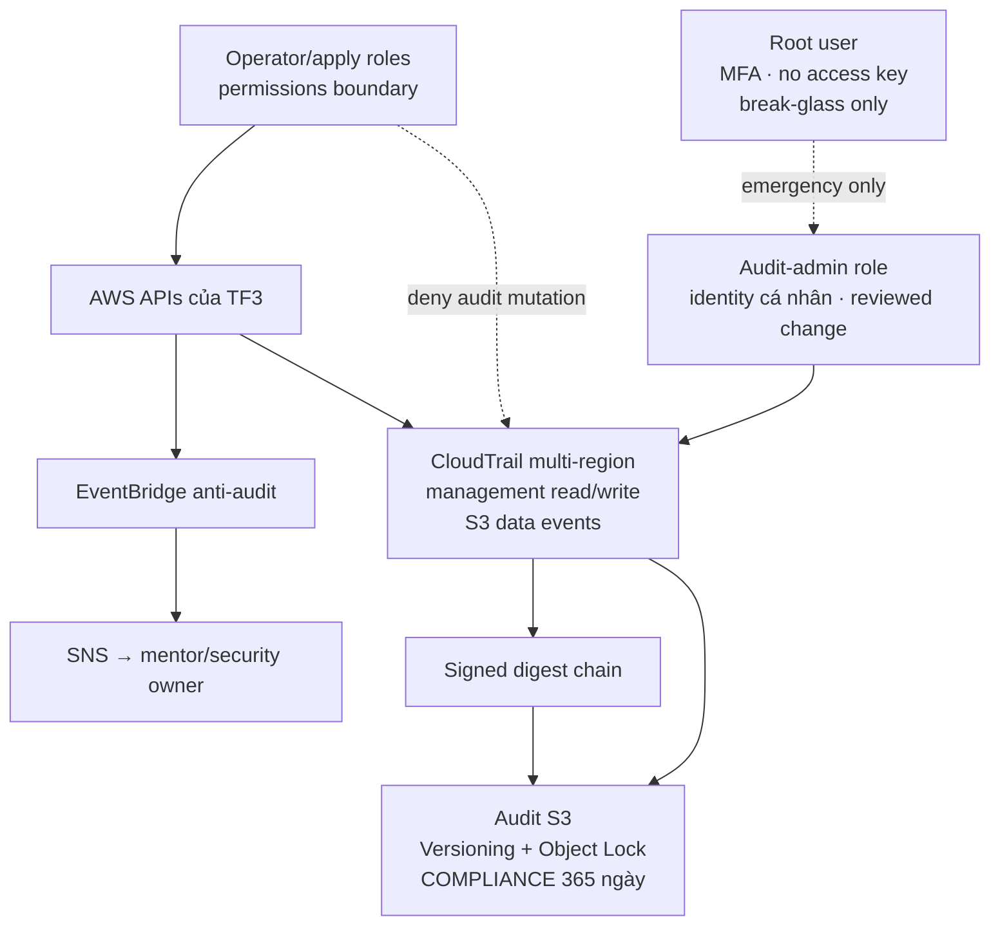

# Mandate 12 — Solution và thiết kế

> **Trạng thái:** READY FOR PREPARATION · phương án chọn: single-account hardened audit; chưa được phép apply.

## 1. Quyết định

Chọn triển khai Mandate 12 trong **một AWS account Free Tier TF3** hiện tại (`197826770971`). “Sub account” trong team là IAM user/role cùng account:

- account-level CloudTrail multi-region;
- management events read/write;
- S3 data events có scope;
- S3 audit bucket riêng có Versioning + Object Lock Compliance 365 ngày;
- log file integrity validation;
- EventBridge/SNS cảnh báo anti-audit;
- audit-admin role tách operator role;
- permissions boundary cho operator sau khi kiểm tra workflow hiện tại.

AWS Organizations/cross-account archive chỉ là phương án tham khảo, **không chọn và không thuộc scope** lần triển khai này. Thiết kế không dùng SCP hay giả định có management/member account.

Live discovery ngày 17/07/2026 xác nhận account hiện **không có CloudTrail trail và không có Object Lock bucket**. Mandate 12 vì vậy tạo mới audit foundation từ product hiện tại; EKS audit log 90 ngày là control live duy nhất được giữ lại cho forensic timeline.

## 2. Kiến trúc mục tiêu



## 3. Trust model

| Identity | Quyền |
|---|---|
| Root user | Break-glass; MFA; không access key; không chia sẻ |
| Audit-admin | Quản trị audit qua change được review; session quy về cá nhân |
| Operator/apply role | Vận hành production nhưng không được mutate trail, archive, alert và boundary bảo vệ |
| Mentor/tester | Chỉ canary actions và denied anti-audit tests |
| Auditor | Read-only status/log/digest/evidence cần thiết |

### Giới hạn single-account

Root vẫn là trust anchor cuối cùng. Vì thế solution không tuyên bố chống account root tuyệt đối; nó chứng minh operator/admin dùng hằng ngày bị chặn và mọi attempt bị cảnh báo. Residual risk được giảm bằng MFA, không root access key, không dùng chung root và break-glass procedure.

## 4. Flow ghi log
  
```mermaid
sequenceDiagram
    participant Actor as User/Role/Service
    participant API as AWS API
    participant CT as CloudTrail
    participant S3 as Audit S3 WORM
    participant Alert as EventBridge/SNS

    Actor->>API: API call
    API-->>CT: management/data event
    API-->>Alert: anti-audit event nếu khớp
    CT->>S3: log file
    CT->>S3: signed digest
    Alert-->>Actor: security owner nhận cảnh báo độc lập
```

## 5. Không có cửa sổ mù

### Control

- EventBridge bắt `StopLogging`, `DeleteTrail`, `UpdateTrail`, `PutEventSelectors`.
- Operator boundary loại quyền mutate CloudTrail/audit bucket/alert controls.
- Audit-admin tách biệt, MFA/session attribution.
- Object Lock bảo vệ log đã delivery.

### Hai giai đoạn

1. **Audit foundation:** trail, bucket, validation, selectors và alert. Khi apply role còn admin, trạng thái chỉ `PARTIAL`.
2. **IAM hardening:** tạo/test bounded operator role, chuyển workflow từng bước, rồi mới loại quyền admin trực tiếp. Sau bước này mới chạy mentor deny test.

Không gộp hai giai đoạn thành một apply vì IAM migration có thể ảnh hưởng CI/CD và emergency access.

## 6. Coverage

### Management events

- All regions, global service events.
- Read và write.
- CloudTrail, IAM/STS, S3 configuration, EKS, Secrets Manager, EC2/VPC, CloudFront/WAF.
- Managed datastore chỉ khi tồn tại live.

### S3 data events

Advanced selector cho ARN prefix nhạy cảm đã được duyệt:

```text
eventCategory = Data
resources.type = AWS::S3::Object
resources.ARN startsWith arn:aws:s3:::<bucket>/<prefix>/
```

Khi attacker kéo nhiều object, team có chuỗi `GetObject` để dựng actor/time/resource. Không bật mọi bucket trước cost baseline.

### Secrets Manager

Management read events ghi `GetSecretValue` và `BatchGetSecretValue`. Log không chứa `SecretString`. Demo dùng canary secret vô giá trị, không dùng `techx-tf3/flagd-sync-token` thật.

## 7. Integrity và retention

- CloudTrail log file integrity validation.
- Digest SHA-256 có chữ ký và liên kết digest trước.
- `validate-logs` theo UTC window đã có digest.
- S3 Versioning + Object Lock `COMPLIANCE` 365 ngày.
- Lifecycle tiering không xóa/rút ngắn retain-until.
- Ưu tiên S3-managed encryption/SSE-S3 cho MVP để tránh thêm CMK destructive path; dùng CMK chỉ khi có yêu cầu riêng.

## 8. Cảnh báo

| Nhóm | Event cần cảnh báo |
|---|---|
| CloudTrail | `StopLogging`, `DeleteTrail`, `UpdateTrail`, `PutEventSelectors` |
| Audit S3 | đổi bucket policy, lifecycle, encryption, Object Lock |
| Alert plane | disable/delete EventBridge rule/target, SNS topic/subscription |
| IAM | detach/sửa boundary, role hoặc policy bảo vệ audit |
| KMS | disable/schedule deletion/policy change nếu dùng CMK |

Alert destination phải được xác nhận trước mentor demo.

## 9. Phạm vi ảnh hưởng

Không thay đổi:

- EKS workload/Helm;
- network, CloudFront, Cloudflare, SSM;
- application source/image pipeline;
- datastore;
- flagd.

Thay đổi account-level:

- CloudTrail;
- audit S3;
- EventBridge/SNS;
- IAM roles/boundary trong change riêng.

## 10. Trade-off

| Phương án | Đánh giá | Quyết định |
|---|---|---|
| Single-account alert-only | Nhanh nhưng admin có thể tự sửa control | Chỉ bootstrap |
| Single-account + bounded operator | Bám dự án hiện tại, không cần account mới; cần migration IAM cẩn thận | **Chọn** |
| Organization trail/cross-account archive | Ranh giới mạnh hơn nhưng cần nhiều account/Organizations | Không thuộc scope account Free Tier đơn lẻ |
| CloudTrail Lake/Insights | Query tốt, thêm chi phí, không thay digest/WORM | Không chọn MVP |

## 11. Cost

- Không bật Lake/Insights.
- Dùng S3 archive làm source of truth.
- EventBridge trực tiếp cho alert nhanh.
- Scope S3 data events theo resource nhạy cảm.
- Đo volume và đặt budget alarm trước khi mở rộng coverage.

## 12. Tiêu chí phê duyệt solution

- Chấp nhận single-account và residual risk root/break-glass.
- Chấp nhận hai change độc lập: audit foundation và IAM hardening.
- Xác nhận retention 365 ngày.
- Xác nhận bucket/prefix nhạy cảm và security alert owner.
- Cho phép live discovery chỉ đọc trước plan.
- Không cho phép apply nếu plan có change/delete workload, edge, network, datastore hoặc flagd.

## 13. Quyết định tích hợp từ static review

Giải pháp đã chọn vẫn khả thi với repository hiện tại, theo hướng **Terraform root audit riêng** (dự kiến `infra/live/audit`) dùng state key riêng. Root này chỉ sở hữu audit bucket, CloudTrail, EventBridge/SNS và policy audit; không đưa các resource đó vào `infra/live/production` đang quản lý EKS/network/edge.

Lý do: production root có nhiều module và provider Cloudflare; gộp audit vào đó tạo blast radius plan không cần thiết. Root audit riêng vẫn tạo được CloudTrail account-level cho cùng account nên coverage không phụ thuộc việc sửa workload EKS hay ứng dụng.

Chưa chốt tên bucket, selector S3, KMS key hay SNS subscriber từ static repo. Các giá trị này là input được phê duyệt ở Phase 0, không hard-code theo suy đoán. IAM operator boundary cũng chưa được coi là hoàn tất vì static code cho thấy apply role vẫn có `AdministratorAccess`.

## 14. Input đã xác nhận từ AWS CLI

- Account mục tiêu là `197826770971`, region chính `ap-southeast-1`; chưa có CloudTrail để import/tái sử dụng.
- Không bucket nào trong 7 bucket hiện có dùng Object Lock. Audit archive phải là bucket mới, tạo Object Lock ngay khi tạo bucket.
- Hai secret hiện có là `sosflow/db-password` và `techx-corp-tf3/flagd-sync-token`. Chúng bắt buộc thuộc management-event coverage, nhưng **không** được dùng làm canary hoặc đọc value để test.
- Chưa có bucket/prefix S3 production nào được owner phê duyệt làm data-event scope. Dùng selector giới hạn, không bật all-S3 data events.
- EKS audit log 90 ngày được giữ làm nguồn timeline Kubernetes; CloudTrail archive Object Lock 365 ngày là nguồn audit AWS độc lập cần tạo mới.

---

**Phiên bản:** v1.3  
**Cập nhật:** 17/07/2026  
**Trạng thái:** READY FOR PREPARATION — chưa được phép apply
