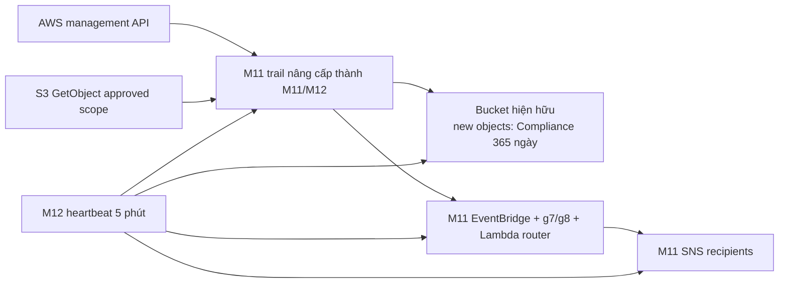

# Mandate 12 — Solution v2: nâng cấp trail M11

## Quyết định

Tái sử dụng CloudTrail, bucket, Lambda router và hai SNS/EventBridge planes của M11. Không tạo trail/archive/topic thứ hai.

## Baseline live dùng làm điểm xuất phát

| Resource | Trạng thái 21/07/2026 | Ý nghĩa cho M12 |
|---|---|---|
| Trail `techx-corp-tf3-audit-detection-ap-southeast-1-trail` | Multi-region, logging/validation bật; management All; không data resource | Update in-place selector, không tạo trail mới |
| Bucket `techx-corp-tf3-audit-trail-ap-southeast-1-197826770971` | Versioning; Governance 14; lifecycle 30; SSE-S3 | Nâng default cho object mới lên Compliance 365, lifecycle 400 |
| 6 EventBridge rules + 2 routers | Tồn tại và enabled | Thêm regional g7 và global g8, mở rộng critical routing, giữ resource hiện hữu |
| 2 SNS topics | Primary còn 3 pending; global còn 1 pending | Phải confirm/replace recipient trước cutover |
| EKS `techx-corp-tf3` | `api/audit/authenticator` bật, retention 90 ngày | Heartbeat giám sát, không đổi EKS trong PR foundation |
| AWS Config | Không có configuration recorder | Không dùng làm dependency M12; heartbeat kiểm tra control trực tiếp |

## Các thay đổi chọn

| Thành phần M11 | Nâng cấp M12 |
|---|---|
| `aws_cloudtrail.audit` | Thay simple selector bằng advanced selectors: Management + approved S3 Object ARNs |
| Object Lock | Default `GOVERNANCE 14` → `COMPLIANCE 365` cho object mới |
| Lifecycle | 30 → 400 ngày |
| Bucket policy | Deny non-CloudTrail object put/delete/retention mutation |
| Router | Critical groups không bị automation allowlist suppress; thêm group 7 audit-control tamper và group 8 IAM/OIDC tamper |
| Regional rules | Thêm EventBridge/SNS/Lambda/CloudWatch/S3 control mutations |
| Heartbeat | Lambda/schedule/alarms dùng topic M11; so exact trail/selectors, bucket controls, rule pattern/target, routers, topics/subscriptions, alarms và EKS audit |
| External watchdog | GitHub Actions 15 phút, OIDC read-only; tạo tín hiệu ngoài AWS account khi role/trust/audit plane bị phá |

## Trade-off

| Phương án | Đánh giá | Quyết định |
|---|---|---|
| Trail M12 riêng | Độc lập state nhưng duplicate management copy/cost | Không chọn |
| Nâng cấp M11 in-place | Một source of truth, tận dụng alert plane; cần coordinated production PR | **Chọn** |
| Cross-account/Organization | Boundary mạnh hơn | Không phù hợp single-account Free Tier hiện tại |

## Integrity và retention

- `enable_log_file_validation=true` giữ nguyên.
- `validate-logs` phải pass trên UTC window sau cutover.
- Object mới có Compliance 365 ngày; lifecycle 400 ngày.
- Object cũ không được claim hồi tố.
- SSE-S3 tiếp tục dùng; không thêm KMS path mới cho archive.

AWS xác nhận default retention áp dụng cho object được đặt vào bucket sau cấu hình; Compliance bảo vệ version cho tới retain-until, kể cả với root. Advanced event selectors thay basic selectors nên thiết kế mới phải giữ rõ selector Management cùng selector S3 Data.

## Blind-window control

1. IAM boundary deny daily identities sửa trail/archive/alert/heartbeat.
2. Router luôn alert nhóm critical kể cả actor là Terraform automation.
3. Heartbeat 5 phút kiểm tra `IsLogging`, log age 20 phút, digest age 90 phút, log validation, exact selectors, S3 lock/lifecycle/encryption/public block, exact rule pattern/target, routers, subscriptions, alarms và EKS audit.
4. Missing invocation và Lambda error có CloudWatch alarm.
5. GitHub watchdog OIDC read-only chạy 15 phút một lần; AssumeRole hoặc check fail tạo trạng thái đỏ ngoài AWS account.

Root vẫn là residual risk trong same-account. Không dùng static key cho watchdog. Nếu chưa có external watchdog/branch protection thì chỉ claim `DEPLOYED/PARTIAL`, trừ khi security/account owner ký chấp nhận residual risk.

AWS Config không phải yêu cầu bắt buộc của Mandate 12 và live hiện chưa triển khai recorder. Không thêm Config vào foundation PR để tránh mở rộng scope/cost; nếu sponsor yêu cầu, triển khai thành change riêng rồi mới thêm Config check vào heartbeat.

## Coverage

- Secrets Manager reads nằm trong management events; log không chứa secret value.
- S3 `GetObject` chỉ covered khi exact ARN kết thúc `/` nằm trong selector.
- Audit bucket không nằm trong S3 selector để tránh recursion.
- EKS audit là supplemental; đã verify live ngày 21/07 nhưng phải revalidate tại change window.

## IAM ownership

- GitHub roles harden tại `infra/bootstrap/github-oidc`.
- Production operator roles harden tại `infra/live/production`.
- Executor M12 chỉ dùng cho identity không thuộc state khác hoặc đã chuyển ownership.

## Trạng thái hoàn thành

- Upgrade applied + digest/heartbeat/coverage pass: `AUDIT READY/PARTIAL`.
- IAM hardening + denied tests + external watchdog + mentor evidence: `VERIFIED` trong scope daily identities; root residual risk phải ký nhận.
- Claim chỉ tính từ cutover timestamp.

## Tài liệu AWS đối chiếu

- [S3 Object Lock](https://docs.aws.amazon.com/AmazonS3/latest/userguide/object-lock.html)
- [CloudTrail data-event selectors](https://docs.aws.amazon.com/awscloudtrail/latest/userguide/filtering-data-events.html)
- [CloudTrail digest chain](https://docs.aws.amazon.com/awscloudtrail/latest/userguide/cloudtrail-log-file-validation-digest-file-structure.html)

---

**Phiên bản:** v2.0
**Cập nhật:** 21/07/2026
**Trạng thái:** READY FOR APPROVAL — chưa được phép apply
