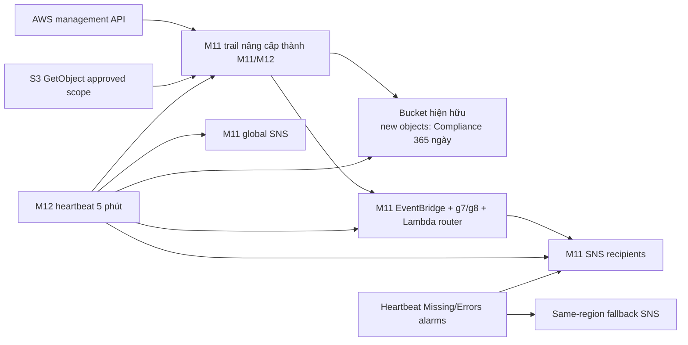

# Mandate 12 — Solution v2: nâng cấp trail M11

## Quyết định

Tái sử dụng CloudTrail, bucket, Lambda router và hai SNS/EventBridge planes của M11. Không tạo trail/archive/router trùng lặp. Tạo đúng một SNS fallback cùng `ap-southeast-1` chỉ cho hai CloudWatch heartbeat alarms; heartbeat Lambda vẫn gửi độc lập tới primary M11 và global M11.

## Baseline live dùng làm điểm xuất phát

| Resource | Trạng thái 21/07/2026 | Ý nghĩa cho M12 |
|---|---|---|
| Trail `techx-corp-tf3-audit-detection-ap-southeast-1-trail` | Multi-region, logging/validation bật; management All; không data resource | Update in-place selector, không tạo trail mới |
| Bucket `techx-corp-tf3-audit-trail-ap-southeast-1-197826770971` | Versioning; Governance 14; lifecycle 30; SSE-S3 | Nâng default cho object mới lên Compliance 365, lifecycle 400 |
| 6 EventBridge rules + 2 routers | Tồn tại và enabled | Thêm regional g7 và global g8, mở rộng critical routing, giữ resource hiện hữu |
| 2 SNS topics | Primary còn 3 pending; global còn 1 pending | Phải confirm/replace recipient trước cutover |
| Heartbeat fallback SNS | Chưa tồn tại | Tạo cùng region với heartbeat alarms; recipient phải confirm sau apply trước khi nghiệm thu |
| EKS `techx-corp-tf3` | `api/audit/authenticator` bật, retention 90 ngày | Heartbeat giám sát, không đổi EKS trong PR foundation |
| AWS Config | Không có configuration recorder | Không dùng làm dependency M12; heartbeat kiểm tra control trực tiếp |

## Các thay đổi chọn

| Thành phần M11 | Nâng cấp M12 |
|---|---|
| `aws_cloudtrail.audit` | Thay simple selector bằng advanced selectors: Management + approved S3 Object ARNs |
| Object Lock | Default `GOVERNANCE 14` → `COMPLIANCE 365` cho object mới |
| Lifecycle | 30 → 400 ngày |
| Bucket policy | Deny non-CloudTrail object put/delete/retention mutation |
| Router | Critical groups không bị automation allowlist suppress; thêm group 7 audit-control tamper và group 8 IAM/OIDC tamper |
| Regional rules | Thêm EventBridge/SNS/Lambda/CloudWatch/S3 control mutations |
| Heartbeat | Lambda gửi độc lập primary/global; alarms gửi primary + fallback cùng region; kiểm tra exact trail/selectors, full archive deny semantics, source semantics, rule pattern/target, full alarm config, CloudWatch topic policy, subscriptions và EKS audit |

## Trade-off

| Phương án | Đánh giá | Quyết định |
|---|---|---|
| Trail M12 riêng | Độc lập state nhưng duplicate management copy/cost | Không chọn |
| Nâng cấp M11 in-place | Một source of truth, tận dụng alert plane; cần coordinated production PR | **Chọn** |
| Cross-account/Organization | Boundary mạnh hơn | Không phù hợp single-account Free Tier hiện tại |

## Integrity và retention

- `enable_log_file_validation=true` giữ nguyên.
- `validate-logs` phải pass trên UTC window sau cutover.
- Object mới có Compliance 365 ngày; lifecycle 400 ngày.
- Lifecycle 400 ngày cũng áp dụng object hiện có chưa bị xóa; cost approval phải bao gồm phần này.
- Object cũ không được claim hồi tố.
- SSE-S3 tiếp tục dùng; không thêm KMS path mới cho archive.
- Chưa chọn transition `GLACIER_IR` trong cutover đầu tiên; chỉ bổ sung bằng change riêng sau cost model dựa trên kích thước object, phí transition/retrieval và minimum duration.

Chọn 365 ngày vì nó tạo cửa sổ điều tra 12 tháng, dài hơn nhiều so với kịch bản attacker ẩn mình nhiều ngày/tuần và bao phủ cả phát hiện trễ lẫn các đợt review theo quý. Lifecycle 400 ngày tạo thêm 35 ngày đệm sau thời hạn Object Lock để hoàn tất export, legal/security review và xử lý sự cố trước khi object đủ điều kiện hết hạn. Đây là target kỹ thuật; Data/Security owner vẫn phải ký xác nhận phù hợp chính sách và chi phí thực tế trước apply.

AWS xác nhận default retention áp dụng cho object được đặt vào bucket sau cấu hình; Compliance bảo vệ version cho tới retain-until, kể cả với root. Advanced event selectors thay basic selectors nên thiết kế mới phải giữ rõ selector Management cùng selector S3 Data.

## Blind-window control

1. IAM boundary deny daily identities sửa trail/archive/alert/heartbeat.
2. Router luôn alert nhóm critical `1/2/3/4/7/8` kể cả actor là Terraform automation.
3. Heartbeat 5 phút kiểm tra `IsLogging`, log age 20 phút, digest age 90 phút, log validation, exact selectors, S3 lock/lifecycle/encryption/public block, exact archive deny statement, exact rule pattern/target, routers, full alarm config, CloudWatch topic policies, subscriptions và EKS audit.
4. Missing invocation và Lambda error có CloudWatch alarm tới primary và fallback cùng region; nếu heartbeat chạy và phát hiện lỗi, nó thử publish primary/global độc lập.

Các g7 alert trong một approved Terraform change vẫn giữ mức CRITICAL. Trước apply phải có change ID chứa Git SHA, saved-plan hash, principal, UTC window và danh sách action dự kiến. Người trực đối chiếu alert với change ID; không mute topic, disable alarm hoặc allowlist g7.
Root vẫn là residual risk trong same-account và nằm ngoài permissions boundary. Giải pháp yêu cầu root MFA, không có root access key, named custodian, incident-only process và security/account owner ký chấp nhận residual risk.

AWS Config không phải yêu cầu bắt buộc của Mandate 12 và live hiện chưa triển khai recorder. Không thêm Config vào foundation PR để tránh mở rộng scope/cost; nếu sponsor yêu cầu, triển khai thành change riêng rồi mới thêm Config check vào heartbeat.

## Coverage

- Secrets Manager reads nằm trong management events; log không chứa secret value.
- S3 `GetObject` chỉ covered khi exact ARN kết thúc `/` nằm trong selector.
- Audit bucket không nằm trong S3 selector để tránh recursion.
- EKS audit là supplemental; đã verify live ngày 21/07 nhưng phải revalidate tại change window.

## Bằng chứng chống “làm mỏng”

Chọn một `PutMetricAlarm` hoặc `PutRule` phát sinh từ chính approved foundation apply. Evidence bắt buộc nối được saved-plan/pre-state → CloudTrail `requestParameters` đã allowlist/redact → post-state read-only. PASS khi actor/session/request ID, trường cấu hình thay đổi và giá trị sau cùng khớp nhau; không chỉ dừng ở “ai gọi API lúc nào”. Không dùng secret value, policy document nhạy cảm hoặc object content làm canary.

## IAM ownership

- GitHub roles harden tại `infra/bootstrap/github-oidc`.
- Production operator roles harden tại `infra/live/production`.
- Executor M12 chỉ dùng cho identity không thuộc state khác hoặc đã chuyển ownership.

## Trạng thái hoàn thành

- Upgrade applied + digest/heartbeat/coverage pass: `AUDIT READY/PARTIAL`.
- IAM hardening + denied tests + mentor evidence: `VERIFIED` trong scope daily identities; root residual risk phải ký nhận.
- Claim chỉ tính từ cutover timestamp.

## Tài liệu AWS đối chiếu

- [S3 Object Lock](https://docs.aws.amazon.com/AmazonS3/latest/userguide/object-lock.html)
- [CloudTrail data-event selectors](https://docs.aws.amazon.com/awscloudtrail/latest/userguide/filtering-data-events.html)
- [CloudTrail digest chain](https://docs.aws.amazon.com/awscloudtrail/latest/userguide/cloudtrail-log-file-validation-digest-file-structure.html)

---

**Phiên bản:** v2.2
**Cập nhật:** 21/07/2026
**Trạng thái:** HANDOFF READY / NOT APPROVED FOR APPLY
